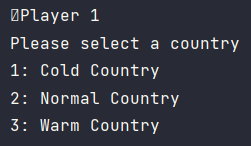
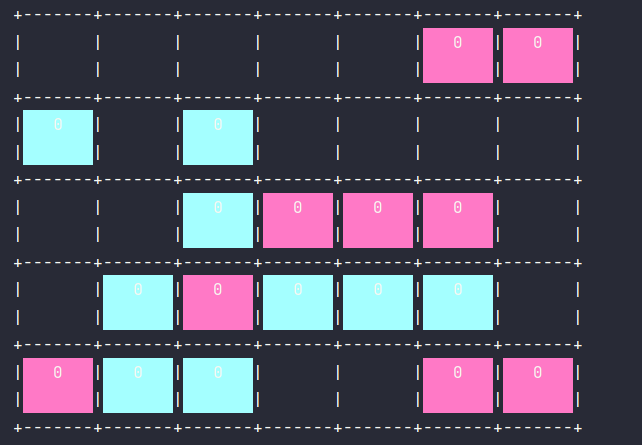
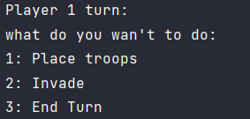
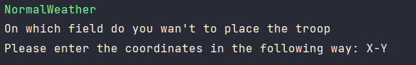
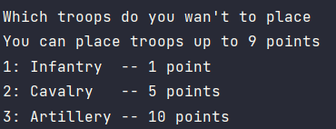
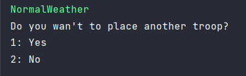
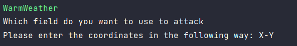

# Risk-WW3
Dit is het project van Thomas, Tom en Cody. Het project in een variatie van Risk gemaakt met het programmaren van 4 design patterns in het programma. De volgende 3 design patterns zijn gebruikt bij het programmeren van dit project.

1. Mediator. De mediator wordt gebruikt als tussenpersoon tussen en het weer en de speler.
2. De abstract factory. Deze design pattern wordt gebruikt voor het maken van de troepen die op het veld kunnen worden ingezet.
3. State. De design pattern stat gebruiken we voor het bepalen van het weer. Als je een koud land bent zal je voordeel hebben als het koud weer is.
4. Strategy. 

##Installatie
Om Risk te installeren moet je de code downloaden.

De code is te vinden in de mail.

Om het programma te runnen moet je op de groene playbutton drukken zodat het scherm tevoorschijn komt wanneer je door instructies krijg wat je op dat moment kunt doen.

##Spelverloop
Het spel speel je met 2 spelers. Om te beginnen moet je kiezen of je een Warm, 'normaal' of koud land te zijn. 

Daarna krijg je het speelveld te zien waarna je kan kiezen wat je wilt doen.

Dit zijn de mogelijkheden die je kan doen:

Optie 1: het plaatsen van troepen

Optie 2: het aanvallen van een stuk land. 

Optie 3: je beurt beëindigen

###Troepen plaatsen
Wanneer je troepen wilt plaatsen moet je eerst aangeven 

De 3 opties waar je uit kan kiezen:

Optie 1: Je kan infantry plaatsen (waarde van 1 per troep)

Optie 2: Je kan cavalry plaatsen (waarde van 5 per troep)

Optie 3: Je kan artillery plaatsen (waarde van 10 per troep)

Als je niet je troepen in 1 keer plaatst krijg je de volgende melding.

Als je geen troepen meer wilt plaatsen kan je aanvallen, als je nog wel troepen wilt plaatsen ga je door met troepen plaatsen

##Aanvallen

Als je aan wilt vallen moet je beginnen met het invoeren van de coördinaten van het veld dat je aan wilt vallen.

